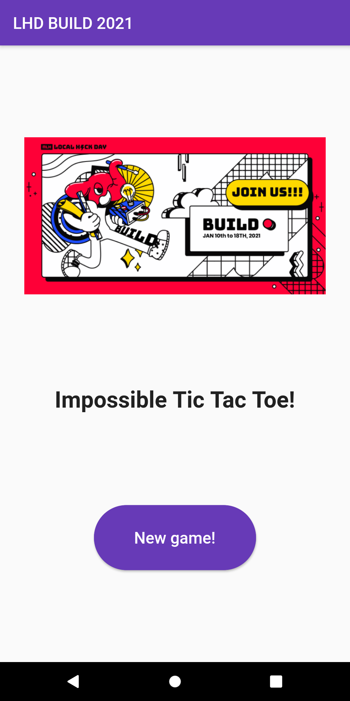
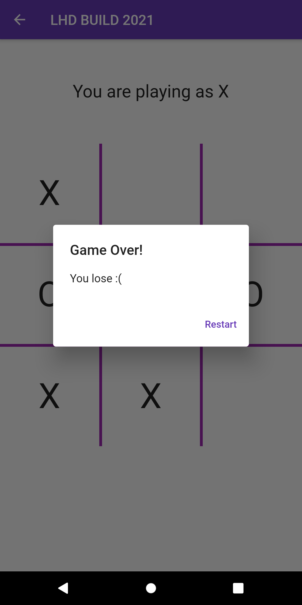

# Tic Tac Toe

Flutter impossible tic-tac-toe app using Minimax algorithm

## Screenshots

&nbsp;&nbsp;&nbsp;&nbsp;
&nbsp;&nbsp;&nbsp;&nbsp;
&nbsp;&nbsp;&nbsp;&nbsp;
&nbsp;&nbsp;&nbsp;&nbsp;

### How to use these files 
The attached files do NOT work as a standalone project. 

If you want to run the code follow these steps 
1) Create a new Flutter project via flutter create some_project 
2) Replace the lib/ folder and the pubspec.yaml file with the attached files 
3) Possibly add assets like images or fonts or adjust the AndroidManifest.xml / Info.plist file to add data/ permissions 
4) flutter packages get 
5) flutter run (with a running emulator or real device connected to your machine) to view the app
